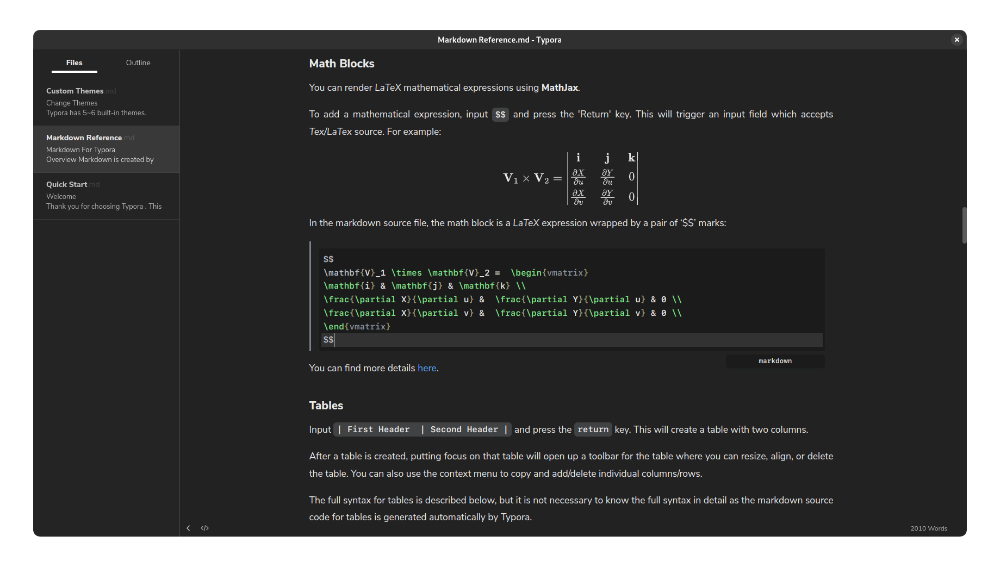

# Adwaita Dark GitHub Theme for Typora

Typora theme based on [github-night](https://github.com/kinoute/typora-github-night-theme) with Adwaita dark colour scheme.



## Installation

1. Download the zipped project or clone the project:
   ```shell
   git clone https://github.com/Rend0e/typora-adwaita-dark-github-theme
   ```
2. Launch Typora and open `Preferences` from the app menu.
3. Go to the `Appearance` tab, and choose `Open Theme Folder`.
4. Copy `adwaita-dark-github.css`, `github-night.css` files and the `github-night` folder to your Typora theme library.
5. Launch or restart Typora and choose `Adwaita Dark Github` theme from the theme menu.

## Credits

* Based on [github-night](https://github.com/kinoute/typora-github-night-theme) created by [Yann Defretin](https://github.com/kinoute).
* The main font used is [Nunito](https://fonts.google.com/specimen/Nunito) designed by Vernon Adams.
* The font used for Code Blocks is [San Francisco Mono](https://developer.apple.com/fonts/) by Apple.
